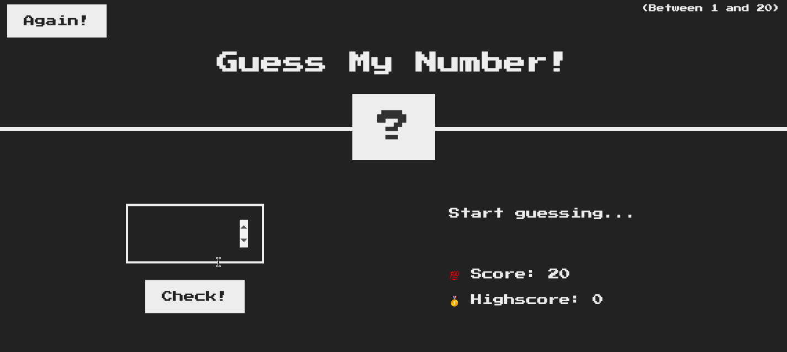

<h1>Jogo: Adivinhe meu número🤔</h1>

<a href="https://github.com/dieegomr/Gess-my-number-game">README</a> in English

Este é um projeto simples que faz parte do <a href="https://www.udemy.com/course/the-complete-javascript-course/?utm_source=adwords&utm_medium=udemyads&utm_campaign=WebDevelopment_v.PROF_la.EN_cc.BR_ti.8322&utm_content=deal4584&utm_term =_._ag_108455848694_._ad_467154447027_._kw__._de_c_._dm__._pl__._ti_dsa-774930035449_._li_1031586_._pd__._&matchtype=&gclid=CjwKCAjw14uVBhBEEiwAaufYx9TbRKLGzNDmGQA8PAaGk99qGom4VgQpkeWedZuxHN_Cs1e6m0LX0BoCUJQQAvD_BwE">"The complete JavaScript Course 2022: From Zero to Expert"</a> onde a ideia era praticar a manipulação do DOM.

O HTML e o CSS estavam prontos, mas era necessário implementar o código JavaScript para fazer o jogo funcionar.

<h3>Como o jogo funciona?</h3>

<ol>
<li>O computador gera um número aleatório secreto;</li>
<li>Você precisa adivinhar o número digitando-o em uma entrada específica;</li>
<li>Você tem 20 tentativas. Há um contador mostrando sua pontuação atual e também há uma caixa de mensagem que mostra o resultado ou algumas dicas.</li>
<li>Você pode reiniciar o jogo a qualquer momento clicando no botão "Again!". Você pode verificar sua pontuação mais alta no campo "HighScore".</li>
</ol>

<h3>Amostra:</h3>

Você pode jogar <a href="https://dieegomr.github.io/Gess-my-number-game/">aqui!</a>

<h3>Como executar este jogo?</h3>

1) Clonar o repositório 

 $ git clone https://github.com/dieegomr/Gess-my-number-game.git

2) Abra a pasta do projeto

3) Abra o arquivo index.html

